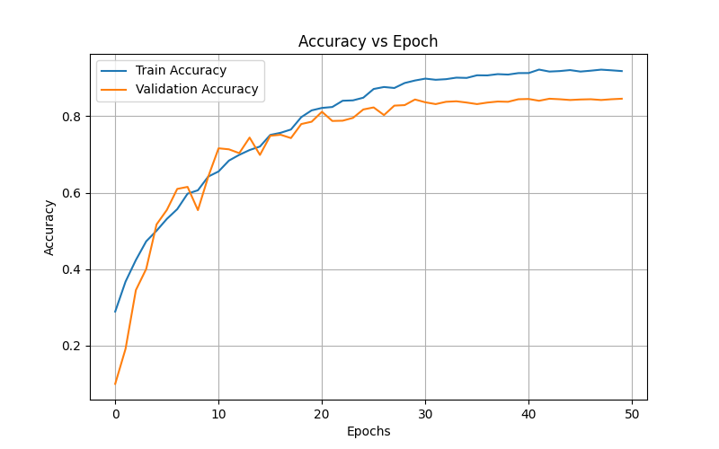
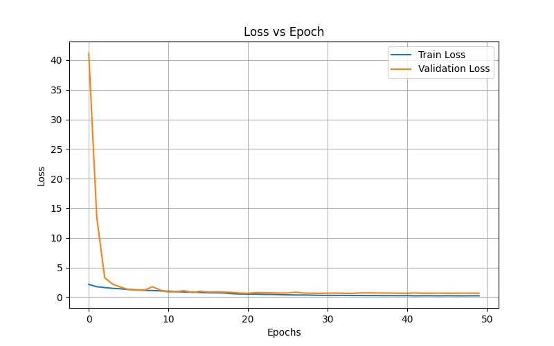
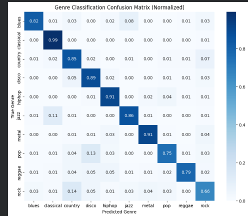

# 🎵 Music Genre Classification Engine

This project implements a Deep Learning-based Music Genre Classifier using the **GTZAN Dataset**. It leverages Convolutional Neural Networks (CNN) to analyze audio signals and classify them into 10 distinct musical genres.

## 📊 Project Overview
The model processes raw audio files, converts them into **Mel-Spectrograms**, and uses a CNN architecture to extract spatial features for high-accuracy genre identification.

## 🚀 Live Demo
You can access the live prediction engine here:
[**Music Genre Classifier - Streamlit App**](https://music-genre-classifier-zcy6cvnbelmcz4zw7zsusc.streamlit.app/)

* **Dataset:** [GTZAN Genre Classification Dataset](https://www.kaggle.com/datasets/andradaolteanu/gtzan-dataset-music-genre-classification/data)
* **Technology Stack:** Python, TensorFlow/Keras, Librosa, Streamlit
* **Model Performance:** Achieved approximately 84% test accuracy on the GTZAN dataset.

## 🖼️ Model Performance
Check out the training metrics below:

### Accuracy vs. Epoch

### Loss vs. Epoch

### Genre Classification Confusion Matrix

## 🛠️ How it Works
1. **Audio Preprocessing:** The application loads a 30-second audio clip using Librosa and converts it into a Mel-Spectrogram.
2. **Feature Extraction:** It converts power spectrograms to Decibel (dB) scale.
3. **Deep Learning Inference:** The CNN model processes these segments and averages the predicted probabilities to give the final genre classification.

## 📝 About the Dataset
The GTZAN dataset is the most commonly used dataset for the evaluation of music genre classification. It consists of 1000 audio tracks each 30 seconds long. It contains 10 genres: *Blues, Classical, Country, Disco, Hiphop, Jazz, Metal, Pop, Reggae, and Rock.*

